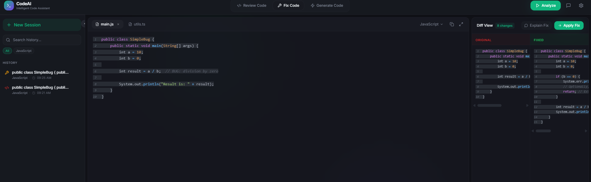
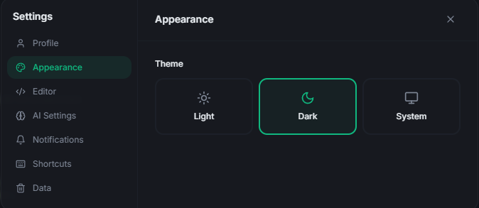
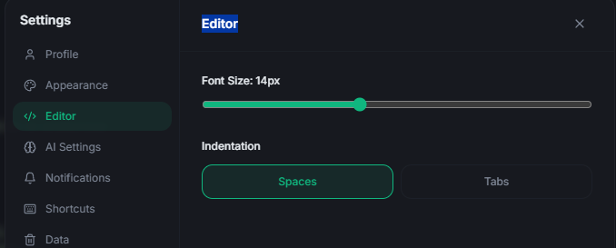
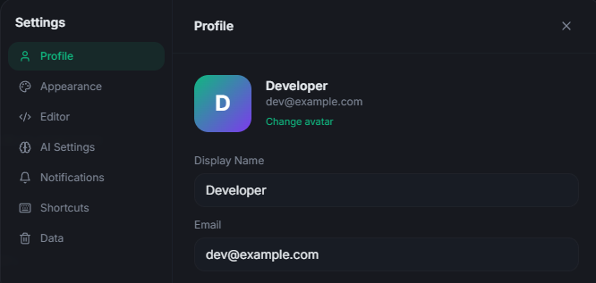

# Code Companion AI


Code Companion AI is a Next.js App Router application for reviewing, fixing, generating, and discussing code with OpenRouter models.

The UI combines a code editor panel, AI result panels, a chat assistant, session history, command palette, and a settings dialog.

## Features

- Review mode: sends source code to an AI reviewer and renders structured findings (error, warning, suggestion) with line numbers.
- Fix mode: asks the model to return improved code and shows original vs fixed output in a side-by-side view.
- Generate mode: produces code from natural-language prompts.
- Chat panel: conversational assistant backed by the same chat endpoint.
- Local history: stores recent sessions in browser localStorage (up to 50 entries).
- Command palette: keyboard-driven action launcher for modes and app actions.
- Responsive layout: desktop split-view and mobile panel switching.

## Screenshots / GIFs

### Main Workspace


### Review Mode



### Generate Mode


### Settings






## Tech Stack

- Next.js 16 (App Router)
- React 18
- TypeScript
- Tailwind CSS
- Framer Motion
- OpenRouter Chat Completions API
- Radix UI primitives + shadcn/ui style components

## Requirements

- Node.js 18.18+ (recommended: current active LTS)
- npm (or another package manager compatible with this lockfile setup)
- OpenRouter API key

## Setup

1. Install dependencies:

```bash
npm install
```

2. Create .env.local in the project root:

```env
OPENROUTER_API_KEY=sk-or-v1-...
```

3. Start development server:

```bash
npm run dev
```

4. Open http://localhost:3000

Important: restart the dev server after changing .env.local so Next.js reloads environment variables.

## Available Scripts

```bash
npm run dev     # Start local dev server
npm run build   # Create production build
npm run start   # Run production server
npm run lint    # Run ESLint
```

## API Endpoints

### POST /api/review

Analyzes code and returns structured review items.

Request body:

```json
{
  "code": "string",
  "language": "string",
  "model": "string"
}
```

Response body:

```json
{
  "feedback": [
    {
      "id": "1",
      "type": "error",
      "line": 12,
      "title": "Short issue title",
      "description": "Detailed explanation",
      "code": "optional suggested snippet"
    }
  ]
}
```

### POST /api/chat

Proxies chat completions for chat, generate, and fix flows.

Request body:

```json
{
  "model": "string",
  "messages": [
    {
      "role": "system",
      "content": "string"
    },
    {
      "role": "user",
      "content": "string"
    }
  ]
}
```

Response body:

```json
{
  "text": "assistant response"
}
```

## Keyboard Shortcuts

- Ctrl/Cmd + K: open command palette
- Ctrl/Cmd + 1: switch to Review mode
- Ctrl/Cmd + 2: switch to Fix mode
- Ctrl/Cmd + 3: switch to Generate mode
- Ctrl/Cmd + Enter: run current action (analyze/generate)
- Ctrl/Cmd + B: toggle sidebar
- Ctrl/Cmd + J: toggle chat panel

## Project Structure

```text
src/
  app/
    api/
      chat/route.ts
      review/route.ts
    page.tsx
    layout.tsx
  components/
    AppSidebar.tsx
    ChatPanel.tsx
    CodeEditorPanel.tsx
    CommandPalette.tsx
    FixPanel.tsx
    GeneratePanel.tsx
    ReviewPanel.tsx
    SettingsDialog.tsx
  hooks/
    useHistory.ts
  lib/
    mock-data.ts
    utils.ts
```

## Persistence Behavior

- Persisted: session history in localStorage under key codeai_history.
- Not persisted by default: chat transcript, selected model, theme, and in-progress editor state.

## Known Limitations

- The editor is currently textarea-based with syntax-highlight display layer (not Monaco).
- Review response parsing is defensive because some model responses can include non-JSON wrappers.
- Some settings controls are UI-only and do not yet modify backend behavior.
- Test scaffolding exists, but test scripts/tooling are not fully wired in package scripts.

## Security Notes

- Do not expose your OpenRouter key in client-side code.
- Keep secrets in .env.local and never commit that file.
- Route handlers forward prompts/code to a third-party model provider; avoid sending sensitive source unless your policy allows it.

## License

No license file is currently present in this repository. Add one before distributing or reusing this project publicly.
